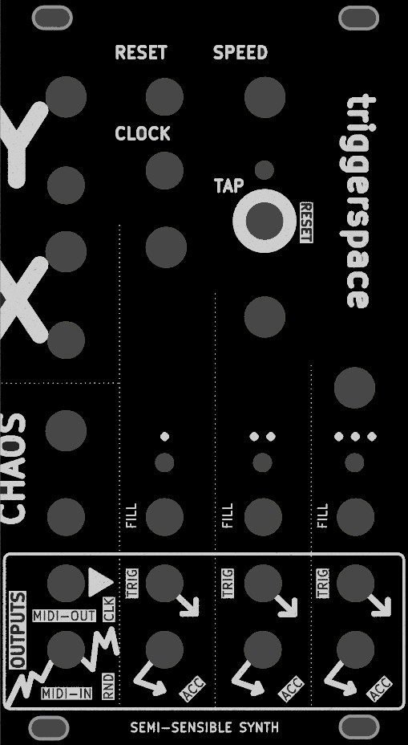

# triggerspace

> **TESTED** - v0.042 works with some simple bodges (build notes below)


This is a remix of the [NanoGris](https://github.com/Quinienl/NanoGris) trigger sequence generator (by Quinie), which in turn was based on the original [Grids](https://pichenettes.github.io/mutable-instruments-documentation/modules/grids/) hardware design by Mutable Instruments / Émilie Gillet, used under a Creative Commons ShareAlike 3.0 License (CC BY-SA 3.0).

You might also call it _"NanoGris-MIDI"_. The front panel looks something like this:



# Features
- Outputs three channels of 'topographic' drum triggers (kick, snare, hihat), with accent outputs
- Internal clock, with reset and swing
- External clock input, via triggers or MIDI clock
- Beat density (fill), X, Y and Chaos inputs to modify each pattern
- MIDI TRS-A output, General MIDI drum notes on channel 10
- 38mA peak current draw on +12V rail (28mA idle)

## Modifications from the NanoGris

- Added MIDI-IN TRS-A jack + 6N137 optocoupler for MIDI clock sync. The original Grids always had this option as an extra jumper on the PCB - now it's broken out onto a more cluttered front panel !
- Added MIDI-OUT TRS-A - required changing the pin used for the clock in to allow use of hardware serial TX/RX, so this modules requires [custom firmware](https://github.com/semi-sensible-synth/Gritty-Grids) even if you aren't using the MIDI-OUT option.
  - I've added pin jumpers and cuttable solder jumpers to allow re-routing for stock firmware if required/desired.
- The CLOCK and RND outputs are repurposed as the TRS-A MIDI-OUT and MIDI-IN ports, respectively. Several pin jumpers can be used to choose if these act as MIDI ports or the original voltage-based trigger outputs.
- Made more space between the FILL knobs (closer to original Grids layout), use a tactile button and cap for TAP button, various tweaks to routing and front panel design

## MIDI-out firmware

Use this: [Gritty-Grids firmware (triggerspace fork)](https://github.com/semi-sensible-synth/Gritty-Grids)

- Supports modified Arduino Nano pin assignments used by _triggerspace_ hardware
- Sends General MIDI drum notes on channel 10 to MIDI-OUT (TRS-A)
  - GM MIDI (and Roland TR-8S) drum note numbers:
  ```
  Out 1:             36 (0x24, C1)  - bass/kick drum
  Out 2:             38 (0x26, D1)  - snare drum
  Out 3 (no accent): 42 (0x2a, F#1) - closed hi-hat
  Out 3 (accented):  46 (0x2e, Bb1) - open hi-hat
  ```

### Future firmware ideas

- We could change velocity based on accent (for bass and snare)
- Disting Ex SD 6 Triggers mode, where notes span 48-53 (unaccented and accented)
- Chord/arp output over MIDI. Set the chord root/inversion to be played via one of the CV inputs, or MIDI-IN
  - Read MIDI notes from MIDI-IN, buffer the last 3 or 6 notes seen and play these for Out1-3, Accent 1-3
- (Crazier ideas: pair it with a SAM2695 or VS1053B based module/expander for GM MIDI audio out ! There seem to be NOS versions on AliExpress ....)

## v0.042 build guide notes (bodges required !)

  - Trying to power the Nano via 5V from U4 voltage regulator to VIN pin 30 didn't work here, despite the original NanoGris design doing it this way. Upon reflection this is no surprise ... 5V isn't enough for the typical AMS1117-5.0 regulator found on a Nano (clone), which needs ~>= 6.5V input to work ! I fixed this with a bodge as follows:
    - Melt the VIN pin 30 solder joint and push it 'up' so it doesn't insert into the female header. This disconnects the Nano from the U4 regulator, but still allows U4 to power the 5V rail in the rest of the module.
    - Attach a bodge wire from the +12V rail pin on the U4 voltage regulator to the protruding VIN pin 30 (I used a single female header to make it easy to remove the Nano if required).
  - I didn't have an LM4040-5.0 on hand, but a 5.1V Zener diode seems to work well enough. Should be a valid option.
  - Can optionally use an 78L50 (TO-92) voltage regulator rather than L7805 (TO-220)
  - Sometimes flashing the firmware seems to fail (can't connect to device) when the Nano is in the module, but seems to work if you take out out of the PCB to flash ¯\_(ツ)_/¯

## Beyond v0.042 changes for next revision

- VIN supply to Arduino Nano should be +12V rail, not +5V !!
  - The 5V lines from the U4 voltage regulator should **NOT** connect to the VIN pin (pin 30).
  - Given the Nano generates a 5V output, this is probably enough to drive our op amps, CMOS shift register and transistor triggers. The LEDs connected to GPIOs are probably take the most current - the module draws 28mA idle and 38mA peak with all LEDs on. The typical voltage regulator on a Nano (or clone) should be able to supply at least 800mA with +12V input, so even if it's not ideal we have a lot of headroom. We could probably mark the voltage regulator and associated capacitors as optional on the silkscreen, and add a solder bridge jumper to connect pin 27 (Nano 5V output) to the 5V rail.
  - We also have enough space to use a 16pin power header and use the Eurorack 5V rail.
- Add silkscreen labels MIDI IN/OUT to J4
- U4 needs more clearance to lay down flat with heatsink on board (or just use a smaller 78L50 {TO-92} regulator - but it's nice to have the option to use a TO-220 package)
- My LEDs are a bit bright. Increase the values of R25, R26, R27, R28 (1k ~ 4.7k - even 1k is quite bright) and 
  label these as "RL" or something on silkscreen so they are easy identify and change as required.
- Back board is a little too offset to the left. Push it ~1mm to the right.
- Do we have room for mute switches/buttons on each channel ?
