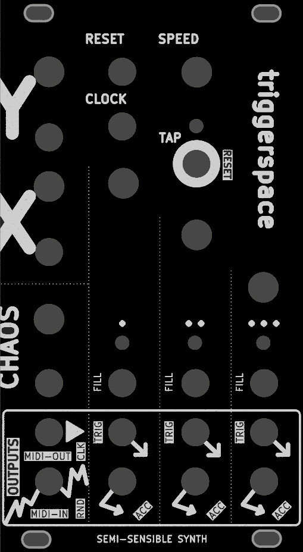
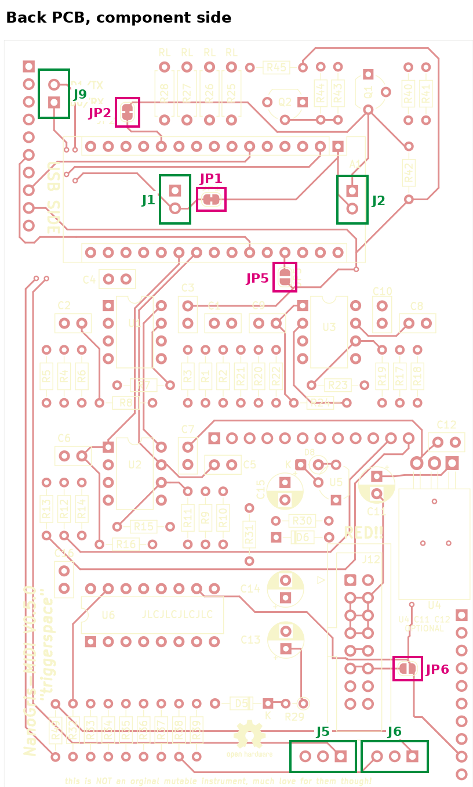
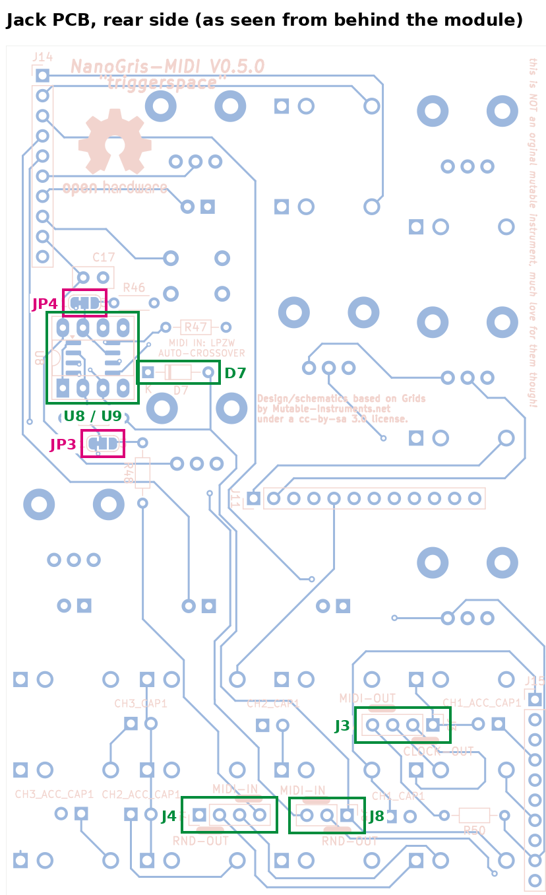

# triggerspace

> **TESTED** - v0.042 works with some simple bodges (build notes below)
>
> **IN PROGRESS** - v0.5.0 removes the v0.042 bodges and adds RC reconstruction-cap
> sockets on the jack PCB's outputs; not yet fabricated or bench-verified (see
> [CHANGELOG.md](CHANGELOG.md))


This is a remix of the [NanoGris](https://github.com/Quinienl/NanoGris) trigger sequence generator (by Quinie), which in turn was based on the original [Grids](https://pichenettes.github.io/mutable-instruments-documentation/modules/grids/) hardware design by Mutable Instruments / Émilie Gillet, used under a Creative Commons ShareAlike 3.0 License (CC BY-SA 3.0).

You might also call it _"NanoGris-MIDI"_. The front panel looks something like this:



# Features
- Outputs three channels of 'topographic' drum triggers (kick, snare, hihat), with accent outputs
- Internal clock, with reset and swing
- External clock input, via triggers or MIDI clock
- Beat density (fill), X, Y and Chaos inputs to modify each pattern
- MIDI TRS-A output, General MIDI drum notes on channel 10
- MIDI TRS input accepts Type A and Type B (v0.5.0, [LPZW auto-crossover MIDI input](https://github.com/kay-lpzw/LPZW_TRS_MIDI))
- 38mA peak current draw on +12V rail (28mA idle)

## Modifications from the NanoGris

- Added MIDI-IN TRS-A jack + 6N137 optocoupler for MIDI clock sync. The original Grids always had this option as an extra jumper on the PCB - now it's broken out onto a more cluttered front panel !
- Added MIDI-OUT TRS-A - required changing the pin used for the clock in to allow use of hardware serial TX/RX, so this modules requires [custom firmware](https://github.com/semi-sensible-synth/Gritty-Grids) even if you aren't using the MIDI-OUT option.
  - I've added pin jumpers and cuttable solder jumpers to allow re-routing for stock firmware if required/desired.
- The CLOCK and RND outputs are repurposed as the TRS-A MIDI-OUT and MIDI-IN ports, respectively. Several pin jumpers can be used to choose if these act as MIDI ports or the original voltage-based trigger outputs.
- Made more space between the FILL knobs (closer to original Grids layout), use a tactile button and cap for TAP button, various tweaks to routing and front panel design

## MIDI-out firmware

Use this: [Gritty-Grids firmware (triggerspace fork)](https://github.com/semi-sensible-synth/Gritty-Grids)

- Supports modified Arduino Nano pin assignments used by _triggerspace_ hardware
- Sends General MIDI drum notes on channel 10 to MIDI-OUT (TRS-A)
  - GM MIDI (and Roland TR-8S) drum note numbers:
  ```
  Out 1:             36 (0x24, C1)  - bass/kick drum
  Out 2:             38 (0x26, D1)  - snare drum
  Out 3 (no accent): 42 (0x2a, F#1) - closed hi-hat
  Out 3 (accented):  46 (0x2e, Bb1) - open hi-hat
  ```

### Future firmware ideas

- We could change velocity based on accent (for bass and snare)
- Disting Ex SD 6 Triggers mode, where notes span 48-53 (unaccented and accented)
- Chord/arp output over MIDI. Set the chord root/inversion to be played via one of the CV inputs, or MIDI-IN
  - Read MIDI notes from MIDI-IN, buffer the last 3 or 6 notes seen and play these for Out1-3, Accent 1-3
- (Crazier ideas: pair it with a SAM2695 or VS1053B based module/expander for GM MIDI audio out ! There seem to be NOS versions on AliExpress ....)

## Build options

### MIDI IN optocoupler (U8 / U9)

From v0.5.0 the MIDI input is the
[LPZW auto-crossover MIDI input](https://github.com/kay-lpzw/LPZW_TRS_MIDI) by Kay Knofe
of LPZW.modules, first used in their WK3 MIDI Thru module. **This input stage is not our
design.** Its author asks that it is credited as the "LPZW auto-crossover MIDI input"
wherever it is mentioned; the credit is on the jack PCB silkscreen next to the circuit,
here, and should be kept in any manual.

It accepts TRS Type A and Type B cables with no switch: the two LEDs of a dual
optocoupler sit anti-parallel across tip and ring, each with its own 220R (R51, R48).
Whichever way round the loop current flows, one LED lights, and the two open-collector
outputs share one 1k pull-up (R47), so the Nano sees the same signal either way.

Fit one of these:

| Build | U8 (DIP-8 socket) | U9 (SOIC-8) | D7 | JP3, JP4 | Accepts |
|---|---|---|---|---|---|
| **Default** | HCPL-2630 or HCPL-2631 | not fitted | not fitted | as made (1-2 bridged) | Type A and B |
| SMD optocoupler | not fitted, no socket | HCPL-0630 or HCPL-0631 | not fitted | as made (1-2 bridged) | Type A and B |
| 6N138 (as v0.042) | 6N138 | not fitted | 1N4148 | cut 1-2, bridge 2-3 | Type A only |

- U9 sits inside U8's DIP-8 footprint on the back of the jack PCB, so fit U8 or U9,
  never both - a DIP socket would sit on top of U9. The HCPL-263x (DIP-8) and HCPL-063x
  (SOIC-8) have the same pinout.
- R46 (4.7k) is fitted in every build but only connected (through JP4) in the 6N138
  build, where it is the 6N138's base resistor. R51 is only used by the dual
  optocouplers; with a 6N138 it goes to an unconnected pin.
- D7 protects the 6N138's LED from reverse voltage. Don't fit it with a dual
  optocoupler: it would sit across one of the LEDs and take the current meant for the
  other, so Type B input would stop working.
- The HCPL-263x/063x is guaranteed to switch at 5mA LED current. A 5V MIDI 1.0 sender
  into a 220R receiver gives about 5mA, so worst-case parts are marginal (typical parts
  switch at about 2mA); 3.3V senders built to the MIDI Association's CA-33 values give
  about 7mA. The 6N138 needs only about 1.6mA, so it tolerates weaker Type A senders.
- Sourcing (JLCPCB, October 2026): the SOIC-8 HCPL-0630 is well stocked; DIP-8 HCPL-263x
  stock there is low, so buy those elsewhere or use the SOIC-8 build.

See [Jumpers](#jumpers) for JP3/JP4 and the other jumper settings.

### -5V reference: LM4040 or 5.1V zener (U5 / D8)

U5 (LM4040LP-5, TO-92) makes the -5V reference (`ref_5`) for the CV input offsets,
fed from -12V through R31 (10k). D8 is an alternative footprint in parallel with it for
a 5.1V zener diode (DO-35, e.g. BZX79C5V1 or 1N5231B), which worked well on a v0.042
build. Fit U5 or D8, not both.

- D8 sits inside U5's outline and is mounted upright: the diode body goes on the round
  pad with the cathode band at the top, and the bent lead goes into the square pad
  (marked K, to GND). The anode is on `ref_5`, because the reference is negative.
- R31 sets the zener current to about (12V - 5.1V) / 10k = 0.7mA. This is below the
  5-20mA test current of common 5.1V zeners, so expect a little less than 5.1V and a
  less stable voltage than the LM4040. The voltage shifts the CV input offsets slightly;
  it doesn't affect the triggers.

### +5V supply and power header (U4, JP5, JP6, J12)

The +5V rail (op amps, shift register, pots, trigger transistors) can come from one of
three sources. Use exactly one: don't connect two regulator outputs together.

| +5V source | U4, C11, C12 | JP5 | JP6 | Power cable |
|---|---|---|---|---|
| **U4 (L7805), default** | fitted | open | open | 10-pin or 16-pin |
| Nano's regulator | not fitted | bridged | open | 10-pin or 16-pin |
| Eurorack +5V | not fitted | open | bridged | 16-pin, from a PSU with +5V |

U4, C11 and C12 are marked "OPTIONAL" on the silkscreen. JP5 and JP6 are open as made.

- **Nano's regulator (JP5):** since v0.5.0 the Nano's VIN is fed from +12V, so its
  onboard 5V regulator is running anyway. JP5 connects the Nano's 5V pin (A1 pin 27) to
  the +5V rail, so that regulator supplies the whole module. The v0.042 module drew
  28-38mA from +12V in total, so the regulator dissipates about (12V - 5V) x 38mA =
  0.27W. With JP5 bridged, the Nano's USB port also powers the +5V rail when the module
  has no Eurorack power.
- **Eurorack +5V (JP6):** J12 is a 16-pin (2x8) footprint. Pins 11 and 12 are the
  Eurorack +5V rail, connected to the module's +5V rail through JP6. Pins 13-16 (CV and
  Gate buses) are not connected. With JP6 open, a 16-pin cable is safe whether or not
  the PSU provides +5V.
- **10-pin header in the 16-pin footprint:** a 2x5 header fits in J12 pins 1-10 (the
  end with the square pad, marked "RED!!" for the cable's -12V stripe), so 10-pin cables
  still work. The
  silkscreen outline is drawn for a 16-pin shrouded header; line up a 10-pin header's
  pin 1 with the square pad.

### RC reconstruction caps (CH*_CAP1)

The six 2-pin sockets next to the output jacks on the jack PCB (`CH1_CAP1`,
`CH1_ACC_CAP1`, `CH2_CAP1`, `CH2_ACC_CAP1`, `CH3_CAP1`, `CH3_ACC_CAP1`) take optional
capacitors to GND that filter the sigma-delta hiss from the Gritty-drumsynth firmware's
synthesised drum voices. Leave them empty for trigger outputs (Gritty-Grids firmware).
Values are still to be chosen (see TODO / IDEAS).

## Jumpers

Most solder jumpers (JP1-JP4) are shorted by a copper trace between their pads as made;
cut the trace with a craft knife to open them. JP5 and JP6 are open as made. Bridge pads
with solder to close a jumper. Pin
jumpers (J) are 2.54mm headers for jumper caps. Pin 1 of each header is the square pad.
The silkscreen next to each header repeats its settings.

Firmware and jack function settings, as shipped:

| Function | Gritty-Grids firmware (MIDI, default) | Stock Grids/NanoGris firmware (triggers) |
|---|---|---|
| Clock input to the Nano | JP2 bridged (clock on D8) | cut JP2, fit J2 (clock on D1) |
| Nano D1/TX | JP1 bridged (D1 drives MIDI OUT) | cut JP1, fit J1 (see below) |
| CLOCK / MIDI OUT jack | J6 1-2, J3 3-4 (optionally also J3 1-2) | J6 2-3, J3 1-2 |
| RND / MIDI IN jack | J8 2-3, J5 1-2, J4 3-4 | J8 1-2, J5 2-3, J4 1-2 |
| +5V source | U4 fitted, JP5 and JP6 open | same |

The jack settings are independent of the firmware: with Gritty-Grids you can still set
either jack back to a trigger output, and the MIDI clock or MIDI notes on that port are
then lost.

### Back PCB



- **JP1** (bridged) connects Nano D1/TX to the MIDI OUT line (`OUT_MIDI`, through R49
  to the jack). **JP2** (bridged) connects the clock input transistor (Q1) to D8. Both
  stay bridged for Gritty-Grids.
- **J1** connects D8 to the MIDI OUT line and **J2** connects the clock input to D1.
  The silkscreen instruction for stock firmware is "cut JP1 & JP2, bridge jumper J1,
  J2": the clock input then reaches D1, where the stock firmware reads it, and D1 is no
  longer connected to the MIDI OUT line. Don't fit J1 or J2 with JP1 and JP2 still
  bridged.
- **J5** (3-pin, to the RND / MIDI IN jack via the jack PCB): 1-2 = MIDI IN (optocoupler
  output to D0/RX), 2-3 = RND trigger output.
- **J6** (3-pin, to the CLOCK / MIDI OUT jack via the jack PCB): 1-2 = MIDI OUT (D1/TX
  through R49), 2-3 = CLOCK trigger output.
- **J9** (2-pin, silkscreen "MIDI IN" / "MIDI OUT"): pin 1 = D0/RX, pin 2 = D1/TX
  (logic level, before R49). Use it to wire up a different MIDI interface (e.g. a DIN
  socket board). If you feed a MIDI signal into pin 1, remove the J5 jumper so the
  optocoupler output doesn't drive the same line.
- **JP5** (open, below the Nano): bridge to power the +5V rail from the Nano's
  regulator. **JP6** (open, next to J12): bridge to power the +5V rail from the Eurorack
  +5V on a 16-pin cable. Fit U4, C11 and C12 only if both are open. See
  [+5V supply and power header](#5v-supply-and-power-header-u4-jp5-jp6-j12).

### Jack PCB



- **J3** (4-pin, CLOCK / MIDI OUT jack): 1-2 connects the sleeve to GND, 3-4 connects the
  ring to +5V through R50. CLOCK OUT: 1-2. MIDI OUT: 3-4; also fit 1-2 so the sleeve
  (cable shield) is grounded at the sending end, as the MIDI specification asks.
- **J4** (4-pin, RND / MIDI IN jack): 1-2 connects the sleeve to GND, 3-4 connects the
  ring to the optocoupler. RND OUT: 1-2. MIDI IN: 3-4 only; leave 1-2 open, since a MIDI
  receiver must not ground the cable shield.
- **J8** (3-pin, RND / MIDI IN jack tip): 1-2 = RND trigger output to the tip, 2-3 =
  optocoupler output to the back PCB (MIDI IN).
- **JP3** and **JP4** (3-pad solder jumpers, 1-2 bridged as made) select the MIDI IN
  optocoupler type. Leave them as made for the dual optocoupler (HCPL-263x in U8, or
  HCPL-063x in U9). For a 6N138, cut 1-2 and bridge 2-3 on both, and fit D7. See
  [MIDI IN optocoupler](#midi-in-optocoupler-u8--u9).
  - JP3 pad 2 goes to U8 pin 2 (HCPL-263x: LED 1 cathode; 6N138: LED anode). Pad 1 =
    jack ring (dual optocoupler), pad 3 = the R48 / D7 node (6N138).
  - JP4 pad 2 goes to U8 pin 7 (HCPL-263x: output 1; 6N138: transistor base). Pad 1 =
    the shared output and R47 pull-up (dual optocoupler), pad 3 = R46 4.7k to GND
    (6N138).

## Changelog

See [CHANGELOG.md](CHANGELOG.md) for the changes in each hardware revision.

## v0.042 build guide notes (bodges required !)

  - Trying to power the Nano via 5V from U4 voltage regulator to VIN pin 30 didn't work here, despite the original NanoGris design doing it this way. Upon reflection this is no surprise ... 5V isn't enough for the typical AMS1117-5.0 regulator found on a Nano (clone), which needs ~>= 6.5V input to work ! I fixed this with a bodge as follows:
    - Melt the VIN pin 30 solder joint and push it 'up' so it doesn't insert into the female header. This disconnects the Nano from the U4 regulator, but still allows U4 to power the 5V rail in the rest of the module.
    - Attach a bodge wire from the +12V rail pin on the U4 voltage regulator to the protruding VIN pin 30 (I used a single female header to make it easy to remove the Nano if required).
  - I didn't have an LM4040-5.0 on hand, but a 5.1V Zener diode seems to work well enough. From v0.5.0 it has its own footprint (D8, see [Build options](#build-options)).
  - Can optionally use an 78L50 (TO-92) voltage regulator rather than L7805 (TO-220)
  - Sometimes flashing the firmware seems to fail (can't connect to device) when the Nano is in the module, but seems to work if you take out out of the PCB to flash ¯\_(ツ)_/¯

## TODO / IDEAS

- Fabricate and bench-verify v0.5.0.
- Choose the RC reconstruction-cap values (and confirm the socket footprint) by bench
  testing with the Gritty-drumsynth firmware.
- Bench-test the +5V supply options (JP5: Nano regulator, JP6: Eurorack +5V) without
  U4.
- Do we have room for mute switches/buttons on each channel ?
